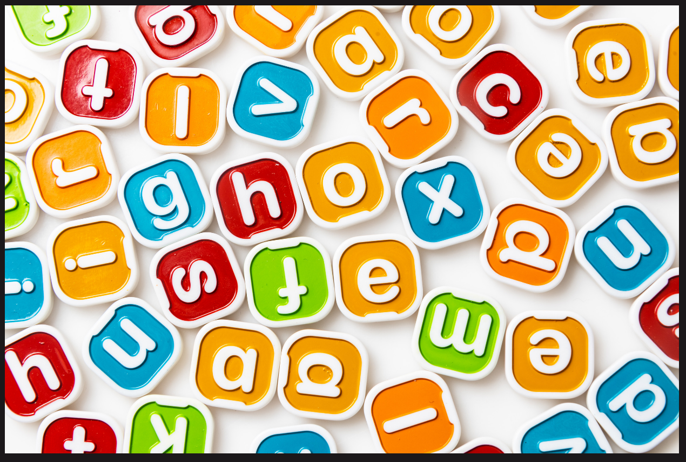

# Strings and Dictionaries in Python

---

## Strings



- The string is a group of characters
- Declared using inverted commas “ ”
- Can hold any data
    - It can include a-z, A-z, 0-9, and also special characters like @,$, etc.
- Each character has an index, Starting from 0 to the length of the string.
- They are immutable. **(No addition, deletion, and replacement possible).**
- Concatenation possible.
    
    ```python
    s="Amay"
    print(s)        # Amay
    s=s+'a'
    print(s)        # Amaya
    ```
    
- Indexing and Slicing work the same as in the list.
    
    ```python
    s="Amay"
    print(s[-3:-1])        # ma
    print(s[:2])           # Am
    ```
    

## Need of Strings

- Lots of information we stored, it actually stored as a string


- For Example, The name of the product, Pincode, and mobile number also, Since we will not perform any mathematical operation on mobile numbers, we considered i a string.

## How to declare a String?

```
 s = "Masai School"

There is a total of 12 characters in this string.
```

### Code 1: Declare a string variable and print it.

```
 name = "Masai";
print(name);

print(name[0]);   # M
print(name[1]);   # a
print(name[2]);   # s
print(name[3]);   # a
print(name[4]);   # i
print(name[5]);   # IndexError: string index out of range

```

### Code 2: Find the length of the String.

```
name = "Jantar Mantar"
print(len(name))    # 13

```

## Real-world use of String

### Code 3: Find whether the user enters a valid length password of at least 6 characters.

```
password = "naved@8755"
if(len(password)< 6):
  print("Invalid : Your Password must be atleast 6 characters long");
else:
  print("Valid Password");

```

## Loop in Strings

### Code 4: Run loop and print each character of String.

```
 name = "Masai School"
for i in range(0, len(name)):
    print(name[i])

```

### Code 5: Run loop on the string and add each character to the third variable and print that variable.

```
name = "Masai School"
bag = "";
for i in range(0, len(name)):
	bag = bag + name[i];

print(bag);

```

## Lists vs Strings

- We can use an List to store the sequence of characters.

### Code 6: Store “Masai” in String and List.

```
name1 = "Masai";
print(name1);
print(name1[0]);

name2 = ["M", "a", "s", "a", "i"];
print(name2);
print(name2[0]);

```

# Strings are immutable

Once the string is declared and initialized, it cannot be updated later.

Suppose you are creating an E-commerce website for your company. What things you will make mutable and immutable.
1-Transaction history
2- Date and time

3- Account Profile such as avatar, name, age, and address

4-Discount coupons


# Functions with strings

- **upper() ⇒**
    - change the lowercase alphabet to uppercase.
    - **Syntax ⇒ `string1.upper()`**
    - **Example➖**
- **title() ⇒**
    - Each word of the string is converted into a title case.
    - **Syntax ⇒ `string1.title()`**
    - **Example➖**
- **capitalize() ⇒**
    - The first character of the complete string is converted to upper case.
    - **Syntax ⇒ `string1.capitalize()`**
    - **Example➖**
- **isupper() ⇒**
    - check if the string is in upper case.
    - Returns boolean value
    - **Syntax ⇒ `string1.isupper()`**
    - **Example➖**
- **islower() ⇒**
    - check if the string is in lowercase.
    - Returns boolean value
    - **Syntax ⇒ `string1.islower()`**
    - **Example➖**
- **isnumeric() ⇒**
    - check if all the characters of the string are numeric.
    - Returns boolean value
    - **Syntax ⇒ `string1.isnumeric()`**
    - **Example➖**
- **isalpha() ⇒**
    - check if all the characters of the string are alphabets.
    - Returns boolean value
    - **Syntax ⇒ `string1.isalpha()`**
    - **Example➖**

# Converting String to List and vice-versa

- **split(delimiter) ⇒**
    - String to List
    - delimiter ⇒ **space(” “), hyphen (-), comma(,), special characters(#, @, $ etc. )**
    - **Example➖**
- **delimiter.join(list) ⇒**
    - List to String
    - delimiter ⇒ **space(” “), hyphen (-), comma(,), special characters(#, @, $ etc. )**
    - **Example➖**
- **list(string) ⇒**
    - String to list of characters.
    - **Example➖**

---

### Code 7: Update Character in String

```
name = "Masai";
name[0] = "N";
print(name);    
#TypeError: 'str' object does not support item assignment

```

- **Let’s use a List to update the string**

### Code 8: Update Character in List

```
name = ["M"," a"," s"," a", "i"]
name[0] = "N";
print(name);

```

We can conclude that strings are immutable. Once it is created, it cannot be updated later but in the List it is possible.

## Update Strings

- We already know that we can not update the string but we can update the List.

### Code 9: Update String using List and third variable. [First Method]

```
**I Way**
name = "Masai";
name2 = []

for i in range(0, len(name)):
	name2.append(name[i]);

name2[0] = "N";
bag=""
for i in range(0, len(name2)):
	bag = bag + name2[i];

print(bag)

```

### Code 10: Update String using List and third variable. [Second Method]

```
**II Way**

name = "Masai"
output = ""
for i in range(0,len(name)):
 if i==0:
		output = output + "N";
 else:
		output = output + name[i];
	

print(output)

```

## Remove char in Strings

- loop in the given string and don’t add that character which you want to remove otherwise add all.

### Code 11: Remove a char from the String

```python
name = "Masai"
output = ""

for i in range(0, len(name)):

	if(name[i] != "s"):
		output = output + name[i];
    
print(output)

```

## Problems in Strings

### Code 12: Count the names starting with N or n

```python
names = ["Nobita", "Naruto", "Shinchan","PowerRangers","Aladin","Noddy"]
count=0

for i in range(0,len(names)):
 name = names[i];
  
	if (name[0]=="N" or name[0]=="n")
			count++;
    
print(count)
```

### Code 13: Count the names which contain A in them.

```python
names= ["Nobita", "Naruto", "Noddy", "Shinchan", "Oswald"];
count=0

for i in range(0,len(names)):

	 name = names[i]
	for j in range(0,len(name)):
	
		if(name[j]=='a' or name[j]=='A'):
		
			count++;
			break;

print(count)

```

### Code 14: Convert lower case to upper case.

```python
name="masai"
lower = "adcdefghijklmnopqrstuvwxyz"
upper = "ABCDEFGHIJKLMNOPQRSTUVWXYZ"
output=""

for i in range(0,len(name)):
  for  j in range(0,len(lower)):
   if (name[i] == lower[j]):
	   output = output + upper[j];	

print(output)
```

---

## Key-Value Pairs (Dictionary)

- Python dictionary is an **ordered collection of items**.


- As of Python version 3.7, dictionaries are *ordered*. In Python 3.6 and earlier, dictionaries are *unordered*.
- Dictionaries are **optimized to retrieve values when the key is known.**
- A dictionary is a collection that is **changeable** and **does not allow duplicates**.
- Dictionaries are written **with curly brackets** and **have keys and values.**
- Holds data as **`key-value`** pair
- No concept of an index system and hence they are unordered.
- To fetch the data we use keys.
- A dictionary can’t have two keys with the same name. [ **keys must be unique and values can repeat**]
- Dictionaries are mutable, so we can
    - add a new key-value pair
    - replace the value not a key
    - delete a key-value pair
- **Syntax**➖
    
    ```python
    dict={
    	"key1": value,
    	"key2": "value",
    }
    ```
    

## Creating Python Dictionary

While the values can be of any data type and can repeat, keys must be of **immutable type (string, number, or tuple with immutable elements) and must be unique**.

- **Dictionary where keys are integer type**
    
    ```python
    Dic={1: "Hello",2: "World"}        # dictionary where keys are integer type
    ```
    
- **Dictionary where keys are of mixed type**
    
    ```python
    myDic={"name":"Sam",2:[5,4,3]}     # dictionary where keys are of mixed type
    ```
    
- Code➖
    
    ```python
    d={
      'name':["Anny", "Bunny", "Danny", "Enav"],
      'age':[25,36,22,12],
      'income':[90,75,80,93]
    }
    print(d['name']) # ['Anny', 'Bunny', 'Danny', 'Enav']
    print(len(d['name']))   # 4
    print(d['name'][len(d['name'])-1])  # Enav
    print(d['name'][len(d['name'])-1]," - ",d['age'][len(d['age'])-1]) # Enav  -  12
    
    # For Loop
    for i in range(len(d['name'])):
    	print("Name -",d['name'][i],"Age -",d['age'][i],"Income(lakhs) -",d['age'][i])
    
    '''
    OUTPUT => 
    Name - Anny Age - 25 Income(lakhs) - 25
    Name - Bunny Age - 36 Income(lakhs) - 36
    Name - Danny Age - 22 Income(lakhs) - 22
    Name - Enav Age - 12 Income(lakhs) - 12
    '''
    ```
    
- **Creating a Dictionary using in-built function** **dict()**
    
    ```python
    # dictionary created using inbuilt function
    
    DicFun=dict({1: "Python",2: "Java", 3: "HTML"})
    ```
    

## Going from List to dictionaries

Here, Instructor needs to compare the List and Dictionaries. What types of things are similar and what things are going to be different


### Code 1: Print the dictionary and type of it

```python
student = {
"name": "Rahul",
"age": 23,
"nationality: "Indian",
"location": "Nainital",
is_married: false,
highest_degree: "Btech"
}
print(student)
print(type(student))

```

### Code 2: Print the "brand" value of the given dictionary

```python
# Print the "brand" value of the dictionary:

thisdict = {
  "brand": "Ford",
  "model": "Mustang",
  "year": 1964
}
print(thisdict["brand"])
```

## Duplicate values will overwrite existing values:

Keys are unique

```python
thisdict = { 
 "brand": "Ford", 
 "model": "Mustang", 
 "year": 1964, 
 "year": 2020,
 "colors": ["red", "white", "blue"]
}
print(thisdict)
```

## **Dictionary Length**

To determine how many items a dictionary has, use the **`len()`**  function.

### Code 3: Getting values of the Index and by using the If-else condition

```python
student = {
"name": "Rahul",
"age": 23,
"nationality": "Indian",
"location": "Nainital",
"is_married": False,
"highest_degree": "Btech"
}
if not student['is_married']:
  print("Naam to suna hi hoga")
else:
 print("Sunn ke koi fayda nahin")

```

## Accessing Elements from the Dictionary

- To access values, a dictionary uses **`keys`**
- Keys can be used either inside **square brackets `[]`** or with the **`get()`** **method**.

## Loop Through a Dictionary

- You can loop through a dictionary by using a `for` loop.
- When looping through a dictionary, the return value is the *keys* of the dictionary, but there are methods to return the *values* as well.

```python
student = {
"name": "Rahul",
"age": 23,
"nationality": "Indian",
"location": "Nainital",
"is_married": False,
"highest_degree": "Btech",
"pcm_marks": [12,45,78]
}

# Ist way to iterate in a python dictionary
for k in student:
  print(k,student[k])
  print("One key-value ends here")

# IInd way of iterating in a python dictionary
for k, v in student.items():
   print(k,":",v)
```

## Updating **Dictionary Elements**

- Dictionaries are **mutable**.

- If the key is already present, then the existing value gets updated.
- If the key is not present, a new (**key: value**) pair is added to the dictionary.
    
    ```python
    Dict={"name": "ABC", "age": 25, "city": "Delhi"}
    
    # Adding
    Dict["country"]="India"
    print(Dict)    
    # {'name':'ABC','age':26,'city':'Delhi','country':'India'}
    ```
    
- **Problem**➖
    
    ```python
    d={
    'name':'Sam',
    'department':'Production',
    'age':27 
    }
    print(d)
    '''
    OUTPUT => {'name': 'Sam', 'department': 'Production', 'age': 27}
    '''
    d['edu']='B.Tech (CS)'
    print(d)
    '''
    OUTPUT =>
    {'name': 'Sam', 'department': 'Production', 'age': 27, 'edu': 'B.Tech (CS)'}
    '''
    ```
    
- **Problem**➖
    
    ```python
    d={
    'name':'Sam',
    'department':'Production',
    'age':27 
    }
    print(d)
    '''
    OUTPUT => {'name': 'Sam', 'department': 'Production', 'age': 27}
    '''
    d['age']=22
    print(d)
    '''
    OUTPUT => {'name': 'Sam', 'department': 'Production', 'age': 22}
    '''
    ```
    

## **Removing Elements from Dictionary**

- The **`popitem()`** method can be used to remove and return an arbitrary **`(key, value)`** item pair from the dictionary.
    
    ```python
    Dict={"name": "ABC", "age": 25, "city": "Delhi", "country": "India"}
    Dict.popitem()
    print(Dict)          # {'name': 'ABC', 'age': 25, 'city': 'Delhi'}
    ```
    

- All the items can be removed at once, using the **`clear()`** method.
    
    ```python
    Dict={"name": "ABC", "age": 25, "city": "Delhi","country":"India"}
    Dict.clear()
    print(Dict)                   # {}
    ```
    
- We can also use the **`del`** keyword to remove individual items or the entire dictionary itself.
    
    ```python
    Dict={"name": "ABC", "age": 25, "city": "Delhi", "country": "India"}
    del Dict["city"]
    print(Dict)     # {'name': 'ABC', 'age': 25, 'country': 'India'}
    del Dict
    print(Dict)     # Throw Error as the Dict is deleted
    ```
    

## Delete a key-value pair

- **Syntax** ⇒ `del dict['key']`
    
    ```python
    d={
    'name':'Sam',
    'department':'Production',
    'age':27 
    }
    print(d)
    '''
    OUTPUT => {'name': 'Sam', 'department': 'Production', 'age': 27}
    '''
    del d['age']
    print(d)
    '''
    OUTPUT => {'name': 'Sam', 'department': 'Production'}
    '''
    ```
    

## Functions with Dictionary

- **get() ⇒**
    - Provides more functionality by fetching the values against the keys
    - **Syntax ➖ `dict.get(key)`**
    - If the key is not part of the dictionary then **get** will not return anything
    - Using the **get function**, we may ask it to return a default value, in case the key is not part of the dictionary.
    - **Syntax**➖ **`dict.get(key, 'default_value')`**
- **keys() ⇒**
    - Return the list of all keys of the dictionary.
    - **Syntax ➖ `dict.keys()`**
    - Example➖
- **values() ⇒**
    - Return the list of all values of the dictionary.
    - **Syntax ➖ `dict.values()`**
    - Example➖
- **items() ⇒**
    - Return the list of tuples, where each tuple has a key-value pair of the dictionary.
    - **Syntax ➖ `dict.items()`**
    - Example➖

**Happy Coding!**